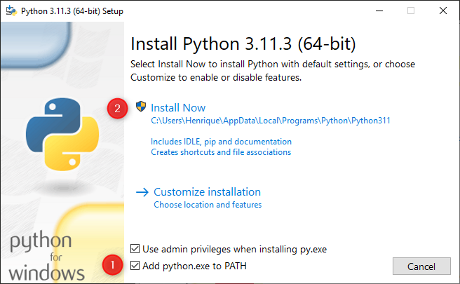

# Hackaton-SPTech
Repositório contendo os arquivos necessários para o Hackaton da Atos.

# Instalação Python

[Link do tutorial](https://python.org.br/instalacao-windows/)

**Passo 1:** Entre no site oficial do Python e baixe a última versão ou [clique aqui:](https://www.python.org/ftp/python/3.12.4/python-3.12.4-amd64.exe)

**Passo 2:** Abra o instalador e marque as opções 1 e 2:



Siga a instalação até o final normalmente.

**Passo 3:** Verifique a instalação abrindo o CMD do Windows e digitando o seguinte comando:

```jsx
python --version
```

Caso ele retorne a versão a instalação foi bem sucedida.

# Instalação VSCode

[Link do tutorial](https://code.visualstudio.com/docs/setup/windows)

**Passo 1:** Entre no site oficial do VSCode e baixe o instalador ou [clique aqui](https://code.visualstudio.com/sha/download?build=stable&os=win32-x64-user):

**Passo 2:** Siga os passos de instalação e lembre de selecionar a caixa que adiciona no PATH.


**Passo 3:** Verifique se a instalação está correta.

# Instalação Git

[Link para tutorial](https://git-scm.com/download/win)

**Passo 1:** Entre no site do [git-scm](http://git-scm.com/download/win) e faça o download do instalador para windows ou [clique aqui](https://github.com/git-for-windows/git/releases/download/v2.46.0.windows.1/Git-2.46.0-64-bit.exe).

**Passo 2:** Siga todas as telas, deixe tudo padrão.

**Passo 3:** Após a instalação será necessário configurar o git com sua conta no github, para isso abra o VSCode e clique para abrir um novo terminal.


**Passo 4:** Com o terminal aberto digite os seguintes comandos um de cada vez preenchendo seu nome e seu email:

```
git config --global user.name "Fulano de Tal"
git config --global user.email fulanodetal@exemplo.br
```

**Passo 5:** Após isso será necessário criar um chave de acesso que conecte seu pc a sua conta, para isso rode o seguinte comando no terminal:

```
ssh-keygen -t ed25519 -C "your_email@example.com"

```

Aperte ENTER até finalizar, ele vai gerar uma chave publica, clique com Ctrl+Mouse no link que o VSCode abrirá o arquivo:


**Passo 6:** Copie a chave publica e acesse este link:

[SSH and GPG keys (github.com)](https://github.com/settings/keys)

Dentro dessa página, basta clicar em New SSH Key, colar a chave e adicionar:


**Passo 7:** Após isso, seu git está configurado.

# Configuração do ambiente

**Passo 1:** Se o passo anterior funcionou, faça o git clone do repositório de testes, para isso basta rodar o seguinte comando:

```bash
git clone [git@github.com](mailto:git@github.com):lucas-albini/Hackaton-SPTech.git
```

**Passo 2:** Agora vamos configurar o ambiente virtual python, ele serve para separar os pacotes do sistema. Rode o seguinte comando:

```bash
pip install virtualenv
```

Com o pacote instalado, navegue até a pasta do hackaton:

```bash
cd .\Hackaton-SPTech\
```

Após isso crie um ambiente virtual rodando o seguinte comando(pode colocar o nome que desejar):

```bash
python -m venv env-hackaton
```

Por último, para ativa-lo rode o comando:

```bash
.\env-hackaton\Scripts\activate
```

Caso o terminal fique com o parênteses verde, o procedimento funcionou:


**Passo 3:** Agora que estamos com o ambiente configurado, basta instalar as bibliotecas que vamos utilizar, rode:

```bash
pip install -r requirements.txt
```

**Passo 4:** Configure as chaves de acesso para a API, para isso rode o comando e preencha com as credenciais fornecidas.

```bash
aws configure
```

**Passo 5:** Rode os códigos para garantir que a configuração funcionou:

```bash
streamlit run .\gerador_textos.py
```

```bash
streamlit run .\gerador_imagens.py
```